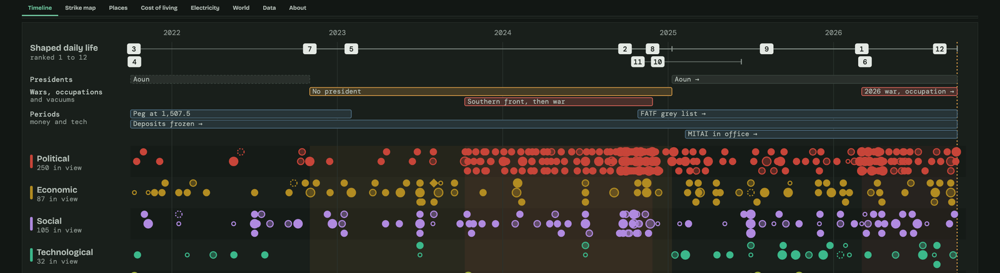
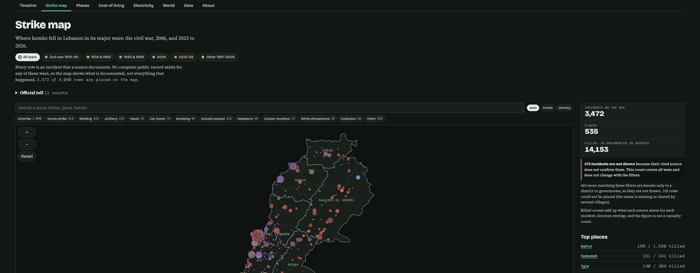
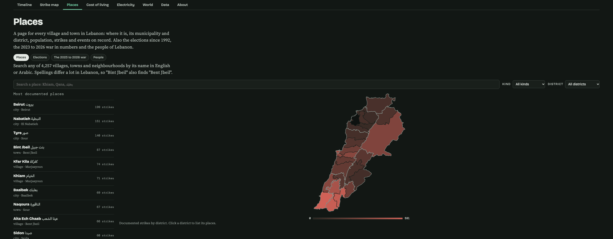
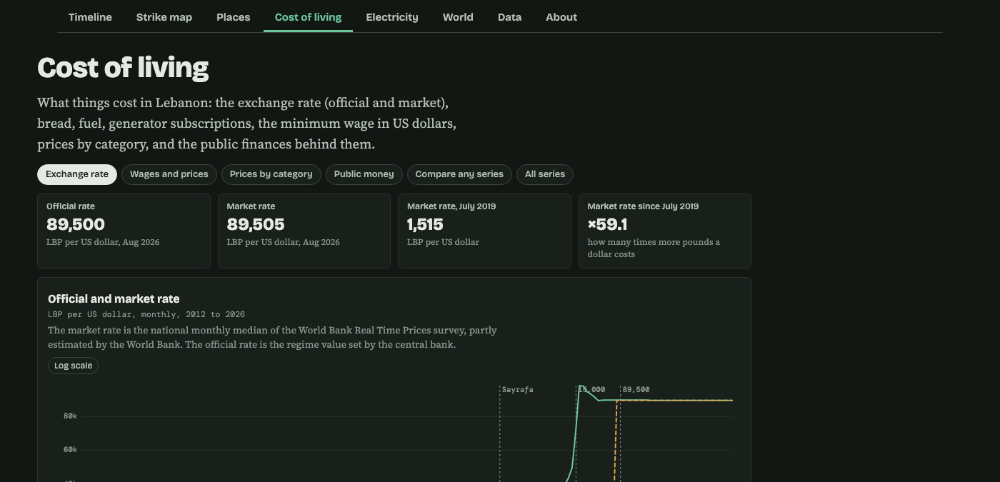
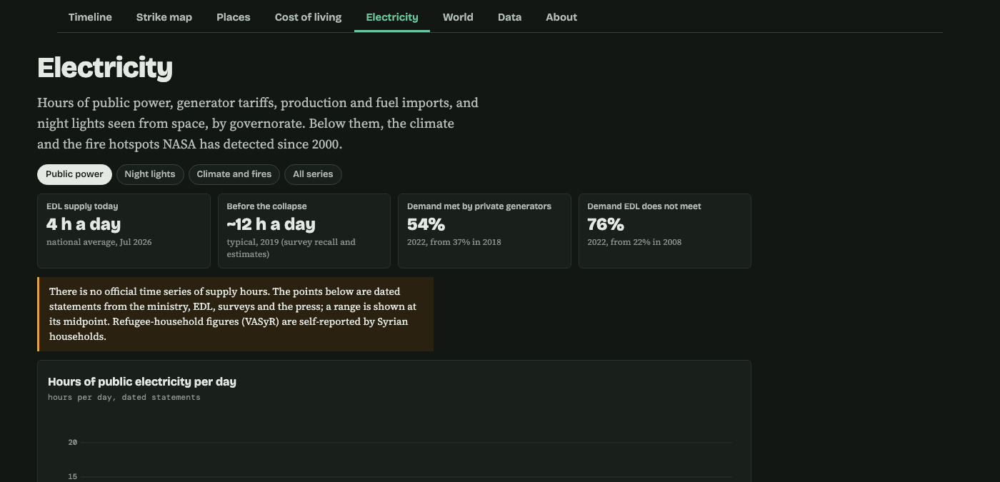
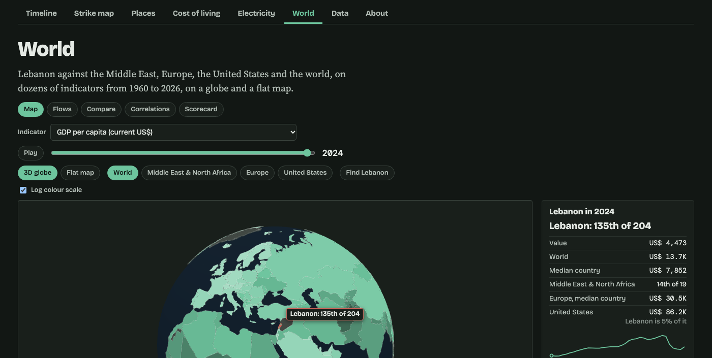
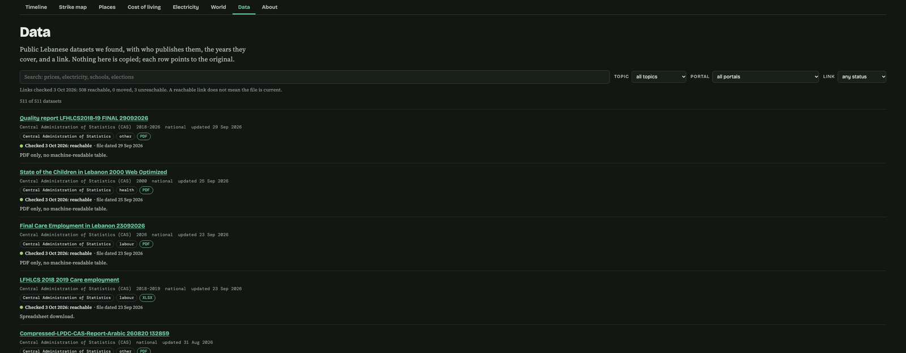
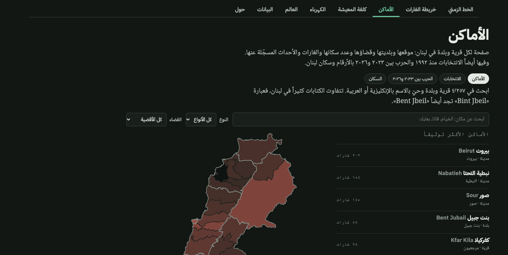
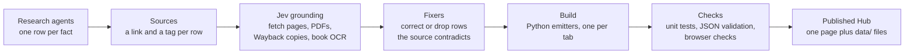

# Free Lebanon Data Hub

[](LICENSE)
[](DATA-LICENSE.md)


Most Lebanese data is scattered, or was never published. The Hub puts what exists in one place, with a source on every
row, and says so where there is none. It covers Lebanon from 1800 to 30 September 2026, in English, Arabic and French.

Live page: <https://claude.ai/artifact/RWViDXvpKXH6KuCeS2qta5>



## The tabs

| | |
|---|---|
| **Strike map.** Documented incidents in the civil war, 2006 and 2023 to 2026.  | **Places.** A page for every village and town.  |
| **Cost of living.** Exchange rates, bread, fuel, generators, wages.  | **Electricity.** Supply hours, generators, production, night lights.  |
| **World.** Lebanon against the world on a 3D globe and a flat map.  | **Data.** Every public Lebanese dataset we found, with a link check.  |

Arabic is a full right-to-left interface, not a label swap:



The screenshots are of the published Hub. Counts in them may differ slightly from the numbers below, which come from a build of this repository.

## What's inside

Counts from `python3 build/build_timeline.py` on this repository.

| | |
|---|---|
| Events on the timeline | 5,893 (1800 to 30 Sep 2026) |
| Distinct cited sources | 5,354 |
| Strike incidents | 4,038 rows, 3,470 placed on the map |
| Places (villages, towns, neighbourhoods) | 4,257, of which 3,637 have an Arabic name from a published source |
| Catalogued public datasets | 511 |
| Time series | 651 |
| World indicators | 51 |
| Laws indexed (titles, numbers, dates, summaries) | 5,381 |
| Translated strings | 16,741 Arabic, 16,741 French |

Every event carries a date, a link to its source and a confidence tag: verified, reported or inference. Each cited page
is also graded by Jev (see below), and the verdict is shown next to the source.

## How it is built



Jev is a small typed-judgment model from [TypeSafe](https://docs.typesafe.ai). Code fetches the page and picks the passage;
Jev answers one probability ("does this page support this row?"); code owns thresholds and every write. Grading is
optional for contributors: the verdicts are checked in, and the build needs no key and no network.

## Quick start

You need Python 3 (tested on 3.14; CI uses 3.12). There is nothing to install.

```bash
git clone https://github.com/sboghossian/free-lebanon-data-hub
cd free-lebanon-data-hub

python3 build/build_timeline.py            # builds site/lebanon-timeline.html and site/data/** (about 30 s)

python3 -m unittest discover -s build -p 'test_*.py'    # unit tests
python3 -m unittest discover -s tools
python3 tools/validate_research.py                      # research files parse, keys line up

cd site && python3 -m http.server 8000     # then open http://localhost:8000/lebanon-timeline.html
```

The browser checks (`node build/check_tl.mjs`, see [CONTRIBUTING](CONTRIBUTING.md)) need Node and Chrome and take about 12
minutes. CI runs the Python steps on every push.

## Repository layout

```
build/      builders, emitters (build/hub), JS and CSS per tab, i18n strings, browser checks, unit tests
research/   the sourced data: timeline rows, series, offices, agreements, strikes, places, datasets, translations
tools/      remap_keys.py (remove rows, keep "file:line" keys), validate_research.py
docs/img/   screenshots used in this README
```

## Contribute

Add an event, a source, a dataset or a translation, or correct a row. Start with [CONTRIBUTING.md](CONTRIBUTING.md): it
has the schemas, the confidence tags, the neutrality rules and how the checks work. Use the issue templates for
corrections, new sources, new datasets, translations and bugs. Please read the [Code of Conduct](CODE_OF_CONDUCT.md).

## What is incomplete

Each gap is also written up on the About tab, with what was done and what cannot be done.

- **Before 1920** the timeline is thinner. The further back, the fewer sources survive, and old books give their author's view.
- **Sources code cannot read.** Paywalls, bot blocks and dead links stay unchecked. About 170 rows are not machine-checked.
- **The strike map** shows documented incidents, not a complete record. Some incidents have no usable place and are not drawn. Mapped totals are not casualty counts.
- **Population.** Lebanon has had no census since 1932. There are registered-voter counts and district estimates, and no resident count for a single place.
- **Arabic place names.** 620 small hamlets have no Arabic name in GeoNames or OpenStreetMap. They stay in Latin letters rather than being guessed.
- **Electricity.** No official series of supply hours exists. The hours shown are dated statements and a labelled proxy.
- **World.** Some years are missing for Lebanon. IMF and trade data are shown but not offered as downloads.
- **Laws.** Titles, numbers, dates and summaries only, never article text. Numbers before about 1960 are partial.
- **Elections.** The 2026 vote was postponed, so there are no results.
- **Translations** were made by language models, then checked against an Arabic and a French glossary (`build/i18n_glossary_check.py`) and by
  sample reviews. In the last review of 300 random strings per language, 9.7% of the Arabic and 11.3% of the French had an error,
  mostly minor wording. Those were fixed, but the rest of the strings probably have errors at a similar rate. No native editor has
  read all of them.
- **Removed rows.** Rows that name private people or private work are not in this repository. Legitimate rows that only share
  a name with them (a place name, for example) were restored when found, but a few may still be missing.

## Credits

Built by Stephane Boghossian with Claude. Sources are credited on every row. Place names come from OCHA, GeoNames and
OpenStreetMap contributors; the world indicators from the World Bank, Our World in Data and others listed in
[DATA-LICENSE.md](DATA-LICENSE.md).

## Licences

Code: [MIT](LICENSE). The Hub's own data: [CC BY-SA 4.0](DATA-LICENSE.md). Third-party data keeps its source's terms,
and some of it (IMF, trade flows) is shown with attribution but not offered as a download. The table is in
[DATA-LICENSE.md](DATA-LICENSE.md).
